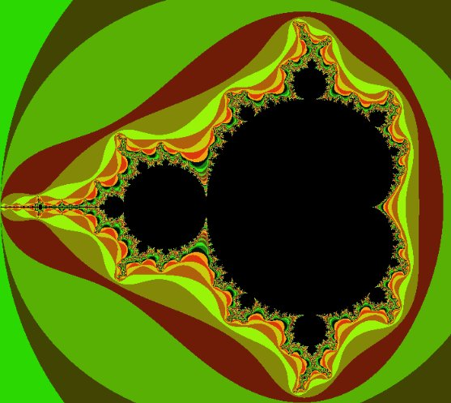
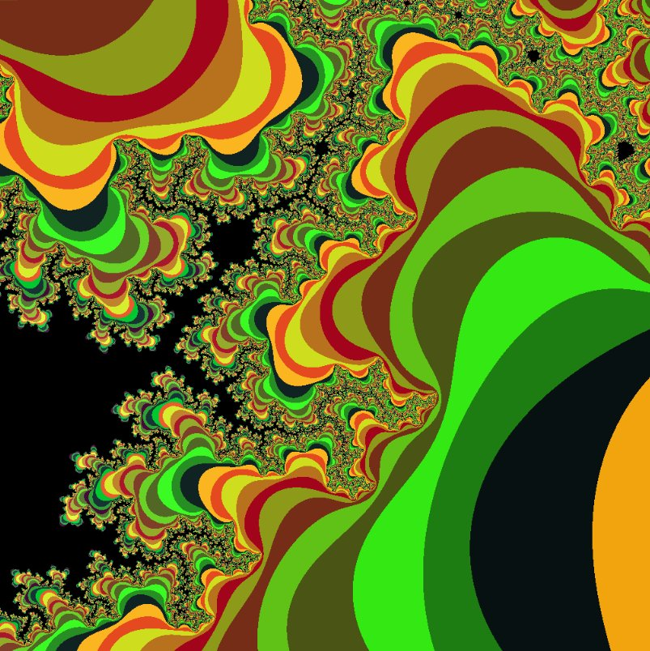

# Fractal Mandelbrot

Permite dibujar un fractal, escoger tabla de colores, hacer zoom, centrarse en algun punto del fractal, etc. No usa librerias externas.

Escrito en C++, y la imagen de resultado es en formato [PPM](https://en.wikipedia.org/wiki/Netpbm_format) en modo binario.

Para compilar

```bash
g++ fractal.cpp
```

Ejecutar

```bash
./a.out
```

Para configurar el fractal se debe reconfigurar desde dentro del codigo (ver los ```#define```).

# Screenshots





